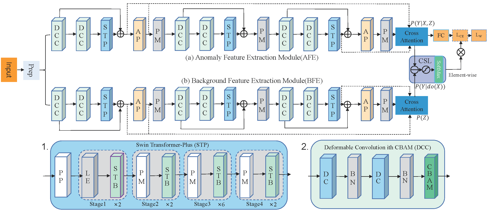
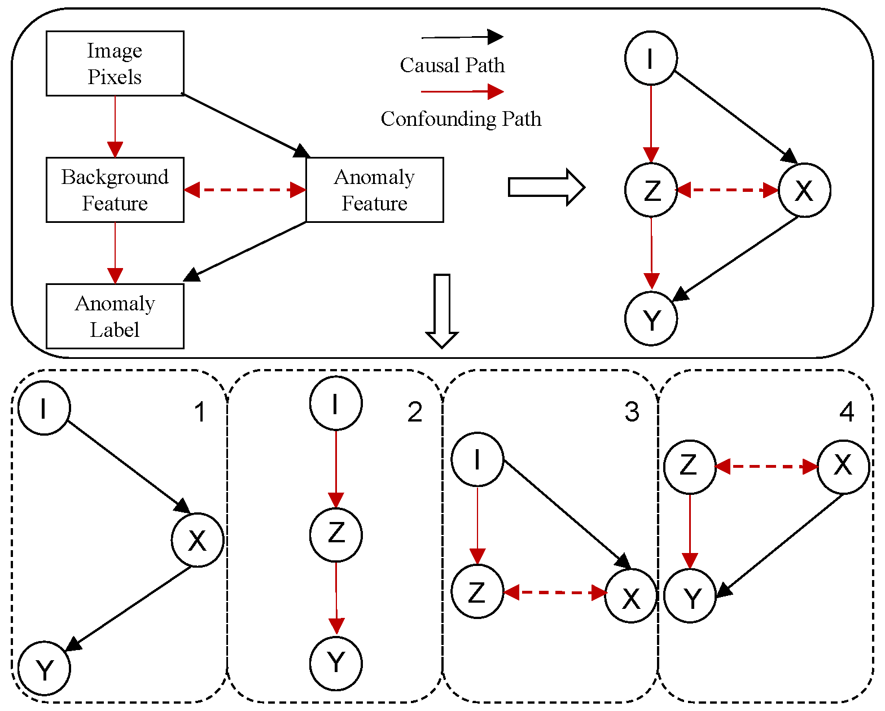

# CASUAL FUSION OF CONVOLUTIONAL NEURAL NETWORK AND VISION TRANSFORMER FOR ANOMALY DETECTION

###abstract:To address the challenge of visual anomaly detection amidst complex background interference. First, we construct a structural causal
model for anomaly detection under complex background interference and propose an intervention strategy to block background feature interference. Then, we build an anomaly feature-sensitive neural network (AFSNN) containing two feature extraction modules
based on the causal intervention strategy. Specifically, due to the
limitations of convolutional neural networks in global features associated with spatial location dependence and the substantial amount
of data required by vision transformers, we use the improved swin
transformer module and the deformable convolutional networks encoder module for extracting global features and local details, respectively. We also designed the cross-attention to fuse these two scales
of feature representation. Finally, we introduce a causality-sensitive
learning module that differentiates the outputs of the two feature extraction modules and constructs a causality-sensitive loss function
by maximizing the output differences. This approach blocks background features and enhances sensitivity to anomaly features during
training. Experiments show that AFSNN can effectively attenuate
the confusing interference of the background pattern

